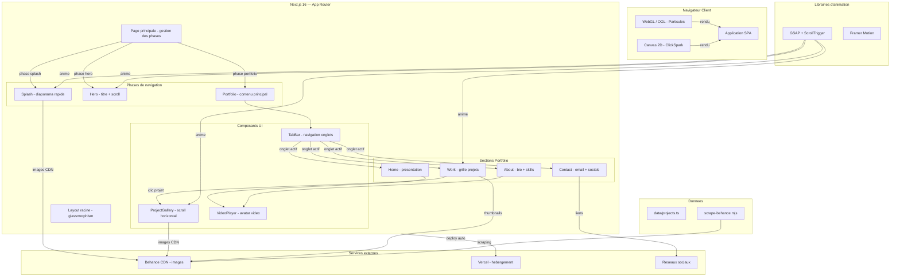

# Portfolio Paloma DELACROIX - Recap Projet

> Genere le 17/02/2026 a 23:30 par `/recap`

## Stack & Architecture

- **Framework**: Next.js 16.1.6
- **Langage**: TypeScript 5
- **Runtime**: React 19.2.3
- **Deploiement**: Vercel (auto-deploy sur push main)
- **Package Manager**: npm
- **Animations**: GSAP 3.14 + Framer Motion 12.34
- **WebGL**: OGL 1.0
- **Styles**: CSS Modules + Tailwind CSS v4

## Structure du Projet

### Diagramme d'Architecture



### Arborescence

```
Portfolio/
├── app/                          # Pages et configuration Next.js (App Router)
│   ├── layout.tsx                #   Layout racine (HTML, glassmorphism blobs)
│   ├── page.tsx                  #   Page unique SPA (phases : splash → hero → portfolio)
│   ├── globals.css               #   Styles globaux, polices Aileron, theme Tailwind
│   └── favicon.ico               #   Icone du site
│
├── components/                   # Composants React (un dossier par composant)
│   ├── Splash/                   #   Ecran d'accueil — diaporama coupes rapides
│   ├── Hero/                     #   Ecran titre avec scroll/swipe pour entrer
│   ├── Home/                     #   Section accueil — texte + avatar video
│   ├── Work/                     #   Grille projets — disposition desordonnee GSAP
│   ├── About/                    #   Section a propos — bio, skills, avatar video
│   ├── Contact/                  #   Section contact — email + reseaux sociaux
│   ├── TabBar/                   #   Navigation onglets (HOME/WORK/ABOUT/CONTACT)
│   ├── ProjectGallery/           #   Galerie horizontale plein ecran (ScrollTrigger)
│   ├── VideoPlayer/              #   Lecteur video avec fallback bouton play
│   ├── Particles/                #   Fond anime de particules WebGL (OGL)
│   └── ClickSpark/               #   Effet d'etincelles vertes au clic (Canvas 2D)
│
├── data/                         # Donnees statiques
│   ├── projects.ts               #   Liste des 9 projets (images Behance, metadonnees)
│   └── behance-scraped.json      #   Donnees brutes scrapees depuis Behance
│
├── public/                       # Fichiers statiques
│   ├── fonts/                    #   Polices Aileron (woff/woff2 : 4 graisses)
│   └── videos/                   #   Video avatar (paloma-avatar.mp4)
│
├── scripts/                      # Scripts utilitaires
│   └── scrape-behance.mjs        #   Scraper Behance via Playwright
│
├── package.json                  # Dependances du projet
├── next.config.ts                # Configuration Next.js (minimale)
├── tsconfig.json                 # Configuration TypeScript
├── postcss.config.mjs            # Configuration PostCSS (Tailwind)
└── CLAUDE.md                     # Instructions projet pour Claude Code
```

## Pages & Routes

| Route | Fichier | Description |
|-------|---------|-------------|
| `/` | `app/page.tsx` | Page unique SPA avec splash, hero et portfolio |

**Layout** : `app/layout.tsx` — Layout racine definissant les metadonnees (titre "Paloma DELACROIX — Portfolio"), la langue FR, et les blobs glassmorphism en arriere-plan.

**Note** : Ce projet est une Single Page Application. La navigation interne se fait entierement cote client via un systeme de phases (`splash` → `hero` → `portfolio`) et d'onglets (HOME, WORK, ABOUT, CONTACT).

## Composants

### Intro / Ecran d'accueil
- `Splash` — Diaporama coupes rapides (style Paul Calver) des images projets avec bouton "Entrer"
- `Hero` — Ecran titre "Paloma DELACROIX - Designer d'espaces" avec detection scroll/swipe

### Navigation
- `TabBar` — Barre de navigation laterale avec 4 onglets (verticale desktop, horizontale mobile)

### Sections de contenu
- `Home` — Presentation avec texte d'accroche, liens sociaux et avatar video
- `Work` — Grille de projets en disposition desordonnee avec parallaxe GSAP au survol
- `About` — Biographie, video avatar et badges de competences (9 skills)
- `Contact` — Headline d'accroche, email et liens reseaux sociaux

### Affichage specialise
- `ProjectGallery` — Galerie plein ecran avec scroll horizontal (GSAP ScrollTrigger), slide titre, images et description
- `VideoPlayer` — Lecteur video autoplay silencieux avec bouton play de fallback

### Effets visuels
- `Particles` — Fond anime de particules WebGL via OGL avec shaders GLSL custom
- `ClickSpark` — Effet d'etincelles vertes au clic via Canvas 2D

## Logique Metier

| Fichier | Role | Responsabilites |
|---------|------|-----------------|
| `data/projects.ts` | Donnees projets | Interface `Project`, tableau de 9 projets Behance, `featuredProjectIds` |
| `scripts/scrape-behance.mjs` | Scraper | Extraction automatique des projets Behance via Playwright |

## State Management

- State local React via `useState` dans `app/page.tsx`
- Phase active (`splash` / `hero` / `portfolio`)
- Onglet actif (`HOME` / `WORK` / `ABOUT` / `CONTACT`)
- Projet selectionne pour la galerie (`Project | null`)
- Animations de transition gerees par GSAP (fade in/out entre onglets)

## Charte Graphique

### Palette de couleurs

| Nom | Hex | Usage |
|-----|-----|-------|
| Peach | `#ffc9b9` | Accent chaud, prenom Hero, hover email, selection texte, blobs |
| Green Main | `#4c956c` | Vert principal, liens, sous-titres, tags, TabBar active, skills |
| Green Dark | `#2c6e49` | Texte principal, titres, headlines, bordures, body color |
| Off-White | `#faf9f6` | Fond du body (ton chaud subtil) |
| White | `#ffffff` | Fond galerie, texte sur boutons actifs |
| Noir | `#000000` | Fond du Splash screen uniquement |

### Typographie

- **Aileron** — Sans-serif, police unique du projet
  - Light (300) : sous-titres, texte descriptif
  - Regular (400) : body general, prenom Hero, bouton Enter
  - SemiBold (600) : liens sociaux, badges skills, lien Behance
  - Bold (700) : titres, headlines, noms, boutons TabBar
  - Fichiers locaux woff/woff2 dans `public/fonts/`

### Variables CSS (Tailwind v4 @theme inline)

```css
--color-peach: #ffc9b9;
--color-green-main: #4c956c;
--color-green-dark: #2c6e49;
--color-white: #ffffff;
--font-aileron: "Aileron", sans-serif;
```

### Classes utilitaires globales

- `.glass-blobs` — Conteneur fixe plein ecran pour les blobs decoratifs (blur 80px)
- `.blob` / `.blob-1` / `.blob-2` / `.blob-3` — Formes circulaires flottantes animees (peach/green)
- `.main-content` — Decalage pour la TabBar laterale (80px desktop, 0 mobile)
- `::selection` — Selection texte : fond peach, texte green dark
- `@keyframes glass-float` — Animation flottante 12s des blobs

### Breakpoint

- **768px** — Unique breakpoint mobile (TabBar en bas, colonnes, padding reduit)

### Echelle z-index

| z-index | Element |
|---------|---------|
| 100 | Splash screen |
| 90 | Hero |
| 81 | Bouton close galerie |
| 80 | ProjectGallery |
| 50 | TabBar |
| 0 | Glass blobs |

## Configuration & Deploiement

### Scripts disponibles

| Commande | Description |
|----------|-------------|
| `npm run dev` | Serveur de developpement Next.js |
| `npm run build` | Compilation pour la production |
| `npm run start` | Serveur de production |
| `npm run lint` | Linting ESLint |

### CI/CD

- Deploiement automatique via **Vercel** sur chaque push `main`
- Pas de pipeline CI/CD explicite (pas de GitHub Actions, Docker, etc.)

## Dependances Cles

### Production

| Package | Version | Role |
|---------|---------|------|
| `next` | 16.1.6 | Framework |
| `react` | 19.2.3 | UI |
| `react-dom` | 19.2.3 | Rendu DOM |
| `gsap` | ^3.14.2 | Animation |
| `@gsap/react` | ^2.1.2 | Integration GSAP/React |
| `framer-motion` | ^12.34.0 | Animation declarative |
| `ogl` | ^1.0.11 | WebGL (particules) |

### Developpement

| Package | Version | Role |
|---------|---------|------|
| `tailwindcss` | ^4 | Styles utilitaires |
| `@tailwindcss/postcss` | ^4 | Plugin PostCSS |
| `typescript` | ^5 | Typage statique |
| `eslint` | ^9 | Linting |
| `eslint-config-next` | 16.1.6 | Regles ESLint Next.js |
| `@types/node` | ^20 | Types Node.js |
| `@types/react` | ^19 | Types React |
| `@types/react-dom` | ^19 | Types React DOM |
